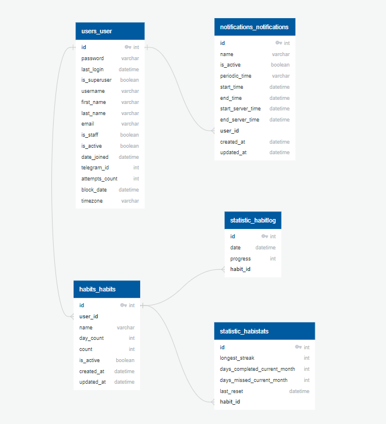

# Инструкция по запуску проекта

## Бэйдж

[](https://gitlab.crja72.ru/django/2024/autumn/course/projects/team-14/pipelines)

## Требования

- **Python** версии 3.9 или выше
- **Git**
- **Virtualenv** для управления виртуальными окружениями
- **Docker** версии 20.10 или выше
- **Docker Compose** версии 1.27 или выше

## 1. Клонирование репозитория

Сначала клонируйте репозиторий с помощью команды:

```bash
git clone https://gitlab.crja72.ru/django/2024/autumn/course/projects/team-14.git
```

Перейдите в директорию проекта:

```bash
cd team-14
```

## 2. Подготовка базы данных и начальные данные

Перейдите в директорию с проектом:

```bash
cd tracker/
```

1. Примените миграции базы данных:

    ```bash
    python manage.py migrate
    ```

## 3. Тестирование проекта

Запустите тестирование перед запуском:

```bash
python manage.py test
```

## 4. Сборка и запуск контейнеров

```bash
docker-compose up --build
```

Проект будет доступен по адресу [http://127.0.0.1:8000/](http://127.0.0.1:8000/).

## 5. Отключение контейнеров

```bash
docker-compose down
```

## ER-диаграмма базы данных

Диаграммы базы данных находится в корне проекта:

- Путь: `\tracker\ER.jpg`


